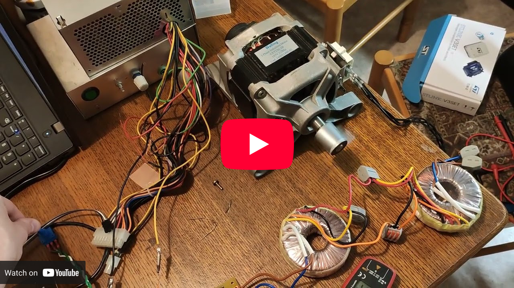
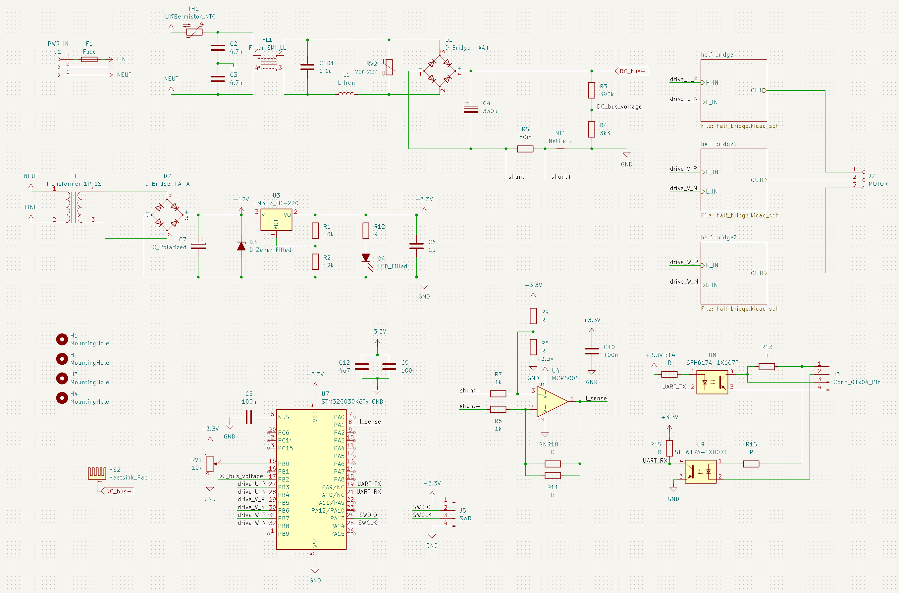

# Three-Phase Induction Motor Controller

The inspiration for this project came from a very characteristic sound in Amsterdam metro trams. During acceleration or braking they make a "shifting gears" sound even though the motors are electric (this sound can also be heard in the demonstration video below).
I became interested in what causes this phenomenon and discovered that the sound is related to the switching behavior and frequency management of inverter-driven AC motors. To better understand these systems, I designed and built a complete three-phase induction motor controller and presented a project for seminar class as part of the course at Faculty of Electrical Engineering, University of Ljubljana.

The project focuses on generating variable-frequency three-phase waveforms using SPWM (Sinusoidal Pulse Width Modulation) and DDS (Direct Digital Synthesis) techniques implemented on an STM32 microcontroller. The controller is capable of driving an asynchronous motor directly from rectified mains voltage while allowing the motor speed to be controlled with a potentiometer.

Here you can find a video demonstration of the final product:

<a href="https://youtu.be/MzE1TKPA2_U?si=Al2wI3Vebfvr4Jmp&t=35">
    
</a>

## Overview

The controller consists of a mains input stage with EMI filtering, a rectifier that generates a high-voltage DC bus, and a three-phase inverter built using IGBT transistors. The inverter is controlled by an STM32 microcontroller, which generates SPWM drive signals for the motor phases.
Motor speed is adjusted by a potentiometer, while the firmware continuously monitors current and DC bus voltage through ADC measurements. The project also implements different switching strategies to reduce transistor losses at higher output frequencies.

The more in-depth report of the working of the driver can be found in the project report (in Slovenian).

## Hardware

The hardware was designed in KiCad and PCB was etched at home.

<a>
    
</a>

Main components:
- EMI filtering
- Mains rectification
- Low-voltage auxiliary power supply
- Three-phase IGBT inverter
- Gate driver circuitry
- Current sensing
- STM32 control circuitry
- Custom PCB

## Firmware

The firmware is written for the STM32G030 microcontroller and generates three-phase SPWM signals for motor control. Frequency generation is implemented using DDS techniques and lookup tables, allowing smooth adjustment of motor speed and phase generation with 120° offsets between phases. The software also handles ADC measurements, frequency management, and inverter switching control.

## Repository Structure

```text
HW/             Hardware design files, schematics, PCB made in KiCad
FW/             STM32 firmware source code
docs/           Documentation and research papers
presentation/   Project report and presentation (sorry, it's in Slovenian)
```

